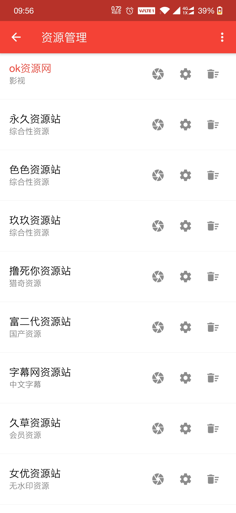
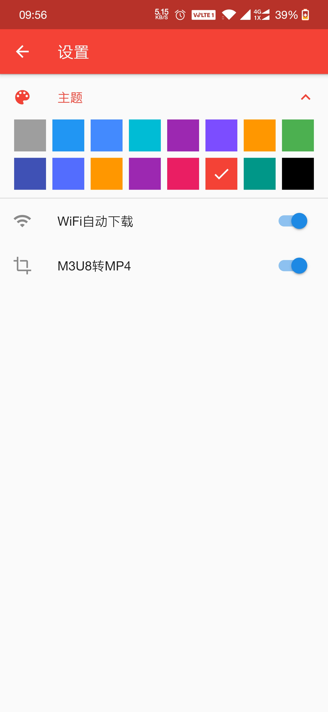

# v_player
Flutter 视频播放APP

基于苹果CMS8.0的资源站收集视频APP

## 项目演示

|首页|视频播放|资源管理|设置|
|:---:|:---:|:---:|:---:|
|||||

## 功能列表

- [x] 视频获取、布局，下拉刷新、上拉加载
- [x] 切换视频源
- [x] 视频分类
- [x] 视频详情页，视频播放功能
- [x] 视频搜索
- [x] 视频源导入导出
- [ ] 视频源编辑功能
- [x] 视频下载，下载通知
- [x] m3u8转MP4
- [x] APP主题设置
- [x] wifi自动下载
- [x] 下载列表管理
- [ ] 删除下载时，删除视频文件
- [ ] 手动清除多余的视频文件
- [ ] 选择文件播放

## 关于视频源的导入导出

视频源的导入导出是通过剪贴板完成的，格式为json字符串。

视频源导入步骤：

1. 导出已有的视频源到剪贴板
2. 复制到任何地方
3. 根据这个json格式，完善你自己的视频源
4. 导入视频源，切换播放即可

视频源查找直接百度【资源站】

## github图片不显示
修改hosts`C:\Windows\System32\drivers\etc\hosts`

在文件末尾添加：
```
# GitHub Start 
192.30.253.112    Build software better, together 
192.30.253.119    gist.github.com
151.101.184.133    assets-cdn.github.com
151.101.184.133    raw.githubusercontent.com
# GitHub End
```
保存后刷新页面即可。

## 捐献

如果你喜欢这个项目，请点一下赞~

你的支持是我最大的动力~~~~~~
<div  align="center">
 
</div>